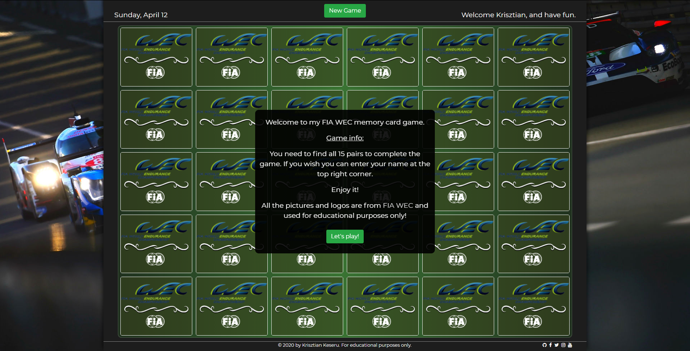

# "FIA WEC" JavaScript memory game
Milestone Project #2: Interactive Frontend Development - Code Institute.

This project is an FIA WEC (World Endurance Championship) themed interactive JavaScript memory game. It's optimised to desktop computer size monitor and tablet size screen.

Link to the the live site: [here](https://milka77.github.io/ms2_memorygame/)


---

## UX

### User Stories
* The user should be read the rules and info about the game at the welcome screen. They should be able to run the game with a simple click on the "Let's play!" button. 
* The user should see the current date and day at the top left corner in the header. 
* The user should be able to optionally enter her/his name at the top right corner in the header to receive a personalised greeting like: "Welcome [name of the palyer], and have fun.".
* The user should see an FIA WEC themed background picture on both sides of the game. 
* The user should be able to click any of the cards which are facing down (not flipped already) to flip it over and try to find the right pairs. 
* The user should be able to find pairs with clicking on the cards. If they clicked two cards and these cards are the same, they match, the background of the card become green and stay flipped, if they don't match the background of the card become red and turning back. 
* The user should not be able to click on a new card till the two already flipped cards which are not matching and not turned back. 
* The user should be receiving an interactive message at the end of the game when all pairs found depends on how many clicks were used to find all the pairs. The messages and the click ranges are the following:

  | Clicks    | |      Messages        |
  |:--------: |-|:-----------:         |
  | 30 - 50   |-|  Legendary!          |
  | 51 - 65   |-| King of the game!    |
  | 66 - 80   |-| Marvelous!           |
  | 81 - 90   |-| Awesome!             |
  | 91 - 105  |-| Nice one!            |
  | 106 - 120 |-| Good job!            |
  | 120 +     |-| You can do it better!|
* The user should be able to close the pop up screen at the end of the game with a click on the "Hurray!" button. 
* The user should be able to start a new game anytime during the game by clicking the "New Game" button on the middle of the header, they don't need to wait till the game is finished. 
* The user should be able to click any of the social media links at the right side of the footer. When the user hovering the cursor over the social media links the hovered link should be turn grey.

### Wireframe 
* [Basic site wireframe](https://github.com/milka77/ms2_memorygame/tree/master/assets/images/wireframe/wireframe_1.png)

* [Info and completion screen wireframe](https://github.com/milka77/ms2_memorygame/tree/master/assets/images/wireframe/wireframe_2.png) 

---
## Features
### Existing Features
* Player name - allows users to enter their name and receive a personalised greetings.
* Memory Game - allows users to click on the cards and play with the game. 
* New Game - allows users to start a new game anytime. 

### Features Left to Implement
* Timed game - which shows the user how long they played with the game.
* Highscore table - allows the user to see other users score and time. 

---
## Technologies Used
* HTML
* CSS
* JavaScript
* [Google Fonts](https://fonts.google.com)
* [GNU Image Manipulating Program - GIMP](http://www.gimp.org)
* [Bootstrap 4](https://getbootstrap.com/)
* [Visual Studio Code](https://code.visualstudio.com/)
* [GitHub Desktop](https://desktop.github.com/)
* [Font awesome](https://fontawesome.com/)

---
## Testing
### Testing All Functions
* **_Function player name:_** By clicking on the input field entered a name, on Chrome browser, there are two ways to activate the function **_first:_** when the input field lose the focus it's activating the personalised welcome message. **_second:_** Enter the name and press enter to receive the personalised message. At all the other browsers entered the player name and pressed enter. At every browser I tested was working well.  

* **_New game button:_** Tested several times at the beginning and at the end of the game was working fine no errors found. Tested in the middle of the game some error is discovered which are fixed. The detailed report you can find under the **_bug report and fix_** section. 

* **_Closing window function:_** Tested at the beginning with the info / welcome screen by clicking the _"Let's play!"_ button. Were no errors found. Tested at the game completion screen by pressing the _"Hurray!"_ button. No errors found. Both screens close normally as it should be. 

* **_Personalised completion message:_** 
  * Tested by playing the game.
  * Tested by changing the variable ```clicks``` for testing of the correct message will be displayed with the correct click range in the console and console log the message. All ranges were tested and were working well. No error was found!

* **_The game logic:_** 
  * **_Card flip:_** Tested by clicking on the cards and the clicked cards was flipping over.

  * **_Found a match:_** When clicking on two cars which are the same, both card's background turns to green and they are staying flipped and locked(non clickable anymore) until the game is not complete or until a new game is not started. The match function was working fine, no error was found!

  * **_Not a match:_** When clicking on the second card and the cards are not mathing, the card's background turns to red and after a few milisecond (let the player to memorise the cards) flipping back and the red background removes from it. The cards are still playable, clickable. The not a match function was working fine, no error was found. 

  * **_Click count:_** Tested by console logging the ```clicks``` variable after the match and not a match functions were executed and changing it by +2 (the two clicks which was used to turn the two cards) under the development status. After no errors were found the "console log" was removed from the code. 

  * **_Checking the game completion:_** There are 30 cards (15 pairs) in the game. The ```pairs``` variable was set to 15 and with every time when a pair got found the match function deducted it by 1. When ```pairs``` reach 0 that means there are no more pairs to find, the completion message will be poping up, the game was complete. Tested the function by playing the game till the end and changing the ```pairs``` variable in the console to check the completion window will pop up. The function was working well, no error was found.

* **_Browser and OS:_** The game was tested across multiple browsers(chrome, firefox, safari, internet explorer) and platform(Win7, Win10, iOS, Mac OS) PCs and on my Ipad mini. I asked a few of my colleagues to test it and give some feedback or possible bug reports.

* **_Social media links:_** All links were tested by clicking on them. All links open the required social media site in a new window, tab. While hovering over one of the links it's turns grey as highlighted. No error was found at any of the links. 

### Bugs and fixes: 
* _**The following bug reports were reported to me wich I fixed:**_
  * **_Bug:_** While playing and the second card was flipped over and it's not a match pressing the new game button and don't wait till the cards turning back the game was frozen and not working anymore. The cards was not flipping over while the user was clicking on it.
  
    **_Solution:_** I added a timeout to the reset function which starts a new game and resetting the gameboard. 
  * **_Bug:_** The game was playable while the info / welcome screen still was visible. 
    
    **_Solution:_** Locking the gameboard until the user not closing the info / welcome screen. 

### Code Validation
* Validated the HTML code with [W3C](https://validator.w3.org/#validate_by_input) and no error found.
* Validated the CSS code with [W3C](https://jigsaw.w3.org/css-validator/#validate_by_input) and no error found.

## Deployment
This project is hosted using GitHub pages, deployed from the master branch. The site will update automatically upon new commits to the master branch. To deploy the project correctly on GitHub pages, the landing site must he named *index.html*

If you want run the project locally you need to clone the repository directly into your favorite editor by writing to the terminal the following: `git clone https://github.com/milka77/ms2_memorygame.git`. 

---
## Media 
All pictures and logos are from [FIA WEC](https://www.fiawec.com) and used for educational purposes only.